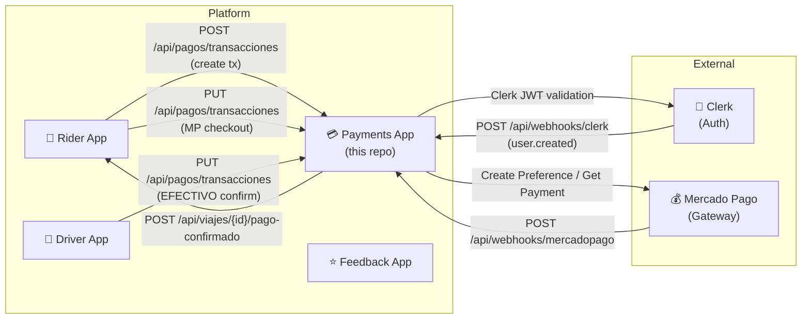
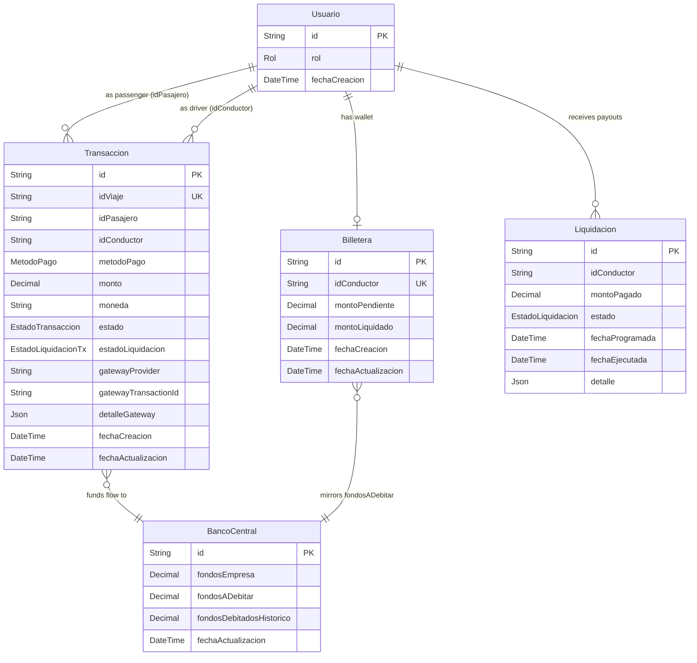
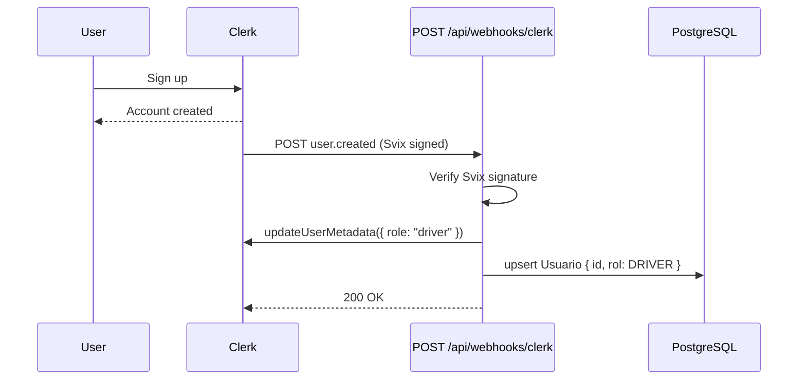
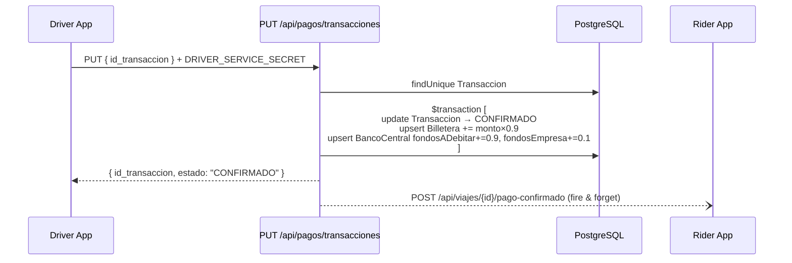
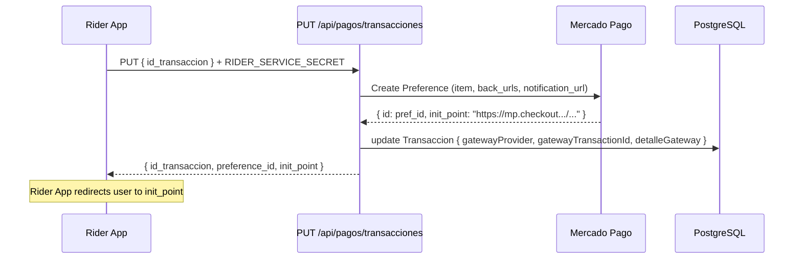
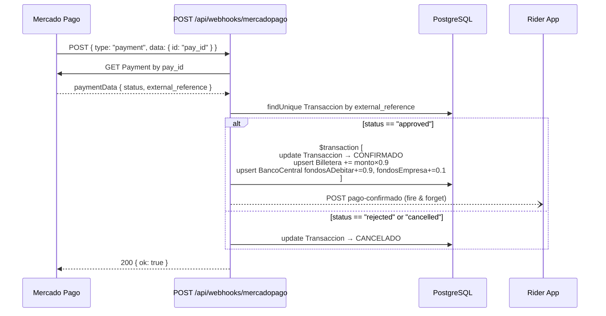
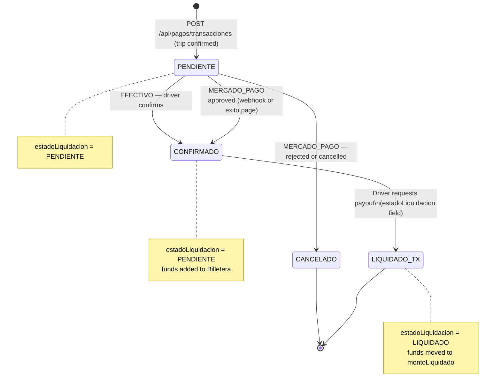
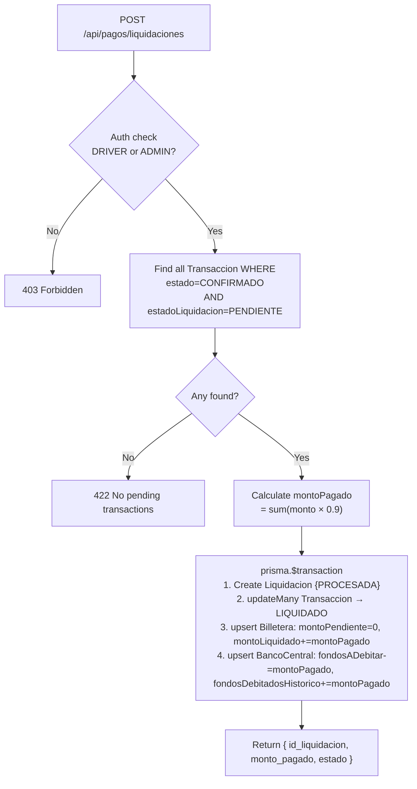

# DriveMe Payments — Complete Codebase Reference

> **How to use this document.** Each section groups files by the *feature or behavior* they implement together, not by folder. At the end there is a [**Concept Guide**](#concept-guide) with numbered entries; sections link to it with arrows like `→ [C1]` so you can look up a shared concept once instead of reading it repeated in every section.

---

## Table of Contents

1. [Platform Overview](#1-platform-overview)
2. [Project Configuration & Stack](#2-project-configuration--stack)
3. [Data Model](#3-data-model)
4. [Authentication & Authorization](#4-authentication--authorization)
5. [Home Page & Layout](#5-home-page--layout)
6. [Transaction Processing](#6-transaction-processing)
7. [Driver Payouts (Liquidaciones)](#7-driver-payouts-liquidaciones)
8. [Transaction History](#8-transaction-history)
9. [Financial Dashboard](#9-financial-dashboard)
10. [Admin Panel](#10-admin-panel)
11. [Utilities](#11-utilities)
12. [Concept Guide](#concept-guide)

---

## 1. Platform Overview

**Payments App** is one of four independent microservices that together form the **DriveMe** transport platform (IAW 2026). Each service has its own database. They communicate over HTTP, forwarding Clerk JWTs for user identity.



### What this app is responsible for

| Responsibility | Details |
|---|---|
| **Create transactions** | Records a payment obligation when a trip ends |
| **Process EFECTIVO** | Driver confirms cash payment → immediate fund distribution |
| **Process Mercado Pago** | Creates an MP Checkout Preference; waits for webhook |
| **Fund distribution** | 90 % to driver wallet, 10 % to company (→ [C4](#c4-the-9010-fund-split)) |
| **Driver payouts** | Driver requests liquidation; pending → liquidated funds |
| **User identity** | Relies on Clerk; roles stored in DB and Clerk metadata |
| **Admin tooling** | UI to seed, update, and test all of the above |

---

## 2. Project Configuration & Stack

### Files involved

| File | Purpose |
|---|---|
| [`package.json`](package.json) | Dependencies, scripts, package manager (pnpm) |
| [`next.config.ts`](next.config.ts) | Next.js settings, security headers |
| [`tsconfig.json`](tsconfig.json) | TypeScript compiler options, path aliases |
| [`prisma.config.ts`](prisma.config.ts) | Prisma CLI configuration (schema & migration paths) |
| [`postcss.config.mjs`](postcss.config.mjs) | Tailwind CSS integration |
| [`.env.example`](.env.example) | Template for required environment variables |

### Key Dependencies

| Package | Version | Role |
|---|---|---|
| `next` | 16.x | App framework (App Router) |
| `react` / `react-dom` | 19.x | UI library |
| `@clerk/nextjs` | 7.x | Authentication provider |
| `@prisma/client` | 7.x | Database ORM |
| `@prisma/adapter-pg` | 7.x | PostgreSQL adapter for Prisma v7 (→ [C9](#c9-prisma-v7-specifics)) |
| `pg` | 8.x | Raw PostgreSQL driver used by the adapter |
| `mercadopago` | 2.x | Server-side MP SDK (Preferences, Payments) |
| `@mercadopago/sdk-react` | 1.x | Browser-side MP Wallet Brick component |
| `svix` | 1.x | Clerk webhook signature verification |
| `dotenv` | 17.x | `.env.local` loading |

### Environment Variables

| Variable | Scope | Description |
|---|---|---|
| `NEXT_PUBLIC_CLERK_PUBLISHABLE_KEY` | Public (browser) | Clerk publishable key |
| `CLERK_SECRET_KEY` | Server only | Clerk secret key |
| `CLERK_WEBHOOK_SECRET` | Server only | Verifies Clerk webhook signatures via Svix |
| `DATABASE_URL` | Server only | PostgreSQL connection string (used by the app at runtime) |
| `DIRECT_URL` | Server only | Direct connection used by Prisma CLI (`db:push`, `db:migrate`) |
| `DRIVER_SERVICE_SECRET` | Server only | Bearer token expected from the Driver App |
| `RIDER_SERVICE_SECRET` | Server only | Bearer token expected from the Rider App |
| `MP_ACCESS_TOKEN` | Server only | Mercado Pago access token (test tokens start with `APP_USR-`) |
| `NEXT_PUBLIC_MP_PUBLIC_KEY` | Public (browser) | MP public key for the Wallet Brick |
| `MP_BACK_URL_BASE` | Server only | Public URL of this app — MP uses it for `back_urls` and `notification_url` |
| `RIDER_APP_URL` | Server only | Base URL of the Rider App (for `pago-confirmado` callbacks) |
| `DRIVER_APP_URL` | Server only | Base URL of the Driver App |

> `MP_BACK_URL_BASE` **must be a publicly reachable URL**. Mercado Pago blocks `localhost` for redirects and webhook notifications. Use the deploy URL or an ngrok tunnel locally.

### Security Headers (`next.config.ts`)

The app applies these HTTP response headers to every request:

| Header | Value | Purpose |
|---|---|---|
| `Content-Security-Policy` | Strict CSP | Prevents XSS and data injection |
| `Strict-Transport-Security` | `max-age=5443200; includeSubDomains` | Forces HTTPS for ~63 days |
| `X-Frame-Options` | `DENY` | Prevents clickjacking |
| `Permissions-Policy` | `camera=(), microphone=(), geolocation=()` | Disables sensitive browser APIs |
| `Cross-Origin-Resource-Policy` | `same-origin` (popups: `cross-origin`) | Controls cross-origin resource sharing |

### Path Aliases (`tsconfig.json`)

```
@/*  →  ./src/*
```

All imports across the app use `@/` instead of long relative paths, e.g. `import { prisma } from '@/lib/prisma'`.

---

## 3. Data Model

### Files involved

| File | Purpose |
|---|---|
| [`prisma/schema.prisma`](prisma/schema.prisma) | Single source of truth for the database schema |
| [`src/lib/prisma.ts`](src/lib/prisma.ts) | Singleton Prisma client used by all API routes |
| [`prisma.config.ts`](prisma.config.ts) | Prisma CLI paths (schema, migrations, `DIRECT_URL`) |

### Prisma Client Setup (`src/lib/prisma.ts`)

Prisma v7 requires a **driver adapter** instead of the old built-in connection handling. The app uses `PrismaPg` from `@prisma/adapter-pg`:

```typescript
import { PrismaClient } from "@/generated/prisma/client";
import { PrismaPg } from "@prisma/adapter-pg";

const adapter = new PrismaPg({ connectionString: process.env.DATABASE_URL });
export const prisma = new PrismaClient({ adapter });
```

The client is exported as a module-level singleton. In Next.js, each server-side module is instantiated once per request worker, so this gives one connection pool per process. See → [C9](#c9-prisma-v7-specifics) for more Prisma v7 specifics.

### Enums

| Enum | Values | Used in |
|---|---|---|
| `Rol` | `RIDER`, `DRIVER`, `ADMIN` | `Usuario.rol`, runtime role checks |
| `MetodoPago` | `EFECTIVO`, `MERCADO_PAGO` | `Transaccion.metodoPago` |
| `EstadoTransaccion` | `PENDIENTE`, `CONFIRMADO`, `CANCELADO` | `Transaccion.estado` |
| `EstadoLiquidacionTx` | `PENDIENTE`, `LIQUIDADO` | `Transaccion.estadoLiquidacion` |
| `EstadoLiquidacion` | `PENDIENTE`, `PROCESADA`, `FALLIDA` | `Liquidacion.estado` |

### Models

#### `Usuario`

Minimal user record — the ID is the Clerk `sub` (user ID), so it links directly to Clerk's identity.

| Field | Type | Notes |
|---|---|---|
| `id` | `String` (PK) | Clerk user ID (`user_…`) |
| `rol` | `Rol` | Default `RIDER`; updated by Clerk webhook on signup or by admin |
| `fechaCreacion` | `DateTime` | Auto-set on create |

#### `Transaccion`

The central record of every payment. One transaction = one trip payment attempt.

| Field | Type | Notes |
|---|---|---|
| `id` | `String` UUID (PK) | Internal transaction ID |
| `idViaje` | `String` (UNIQUE) | Trip ID from the Rider/Driver App — one trip, one transaction |
| `idPasajero` | `String` | Clerk user ID of the passenger |
| `idConductor` | `String` | Clerk user ID of the driver |
| `metodoPago` | `MetodoPago` | `EFECTIVO` or `MERCADO_PAGO` |
| `monto` | `Decimal(12,2)` | Trip amount in full |
| `moneda` | `String` | ISO 4217 currency code, default `"ARS"` |
| `estado` | `EstadoTransaccion` | Payment state (→ [C5](#c5-transaction-state-machine)) |
| `estadoLiquidacion` | `EstadoLiquidacionTx` | Settlement state — `PENDIENTE` until liquidated |
| `gatewayProvider` | `String?` | `"mercadopago"` or `"seed"` |
| `gatewayTransactionId` | `String?` | MP Preference ID or Payment ID |
| `detalleGateway` | `Json?` | Raw gateway response stored for auditing |
| `fechaCreacion` | `DateTime` | Auto-set on create |
| `fechaActualizacion` | `DateTime` | Auto-updated on every change |

#### `Billetera`

The driver's wallet. Tracks money that has been earned but not yet paid out vs money already paid out.

| Field | Type | Notes |
|---|---|---|
| `id` | `String` UUID (PK) | — |
| `idConductor` | `String` (UNIQUE) | Clerk user ID of the driver — one wallet per driver |
| `montoPendiente` | `Decimal(12,2)` | Earned, confirmed, not yet liquidated (90% of trip amount) |
| `montoLiquidado` | `Decimal(12,2)` | Cumulative total of all completed payouts |
| `fechaCreacion` | `DateTime` | — |
| `fechaActualizacion` | `DateTime` | — |

#### `Liquidacion`

One record per payout event. Captures the snapshot of what was paid and when.

| Field | Type | Notes |
|---|---|---|
| `id` | `String` UUID (PK) | — |
| `idConductor` | `String` | Driver being paid |
| `montoPagado` | `Decimal(12,2)` | Net amount sent (sum of 90% of all included transactions) |
| `estado` | `EstadoLiquidacion` | `PROCESADA` on success; `FALLIDA` on error |
| `fechaProgramada` | `DateTime` | When the payout was requested |
| `fechaEjecutada` | `DateTime?` | When it was actually processed |
| `detalle` | `Json?` | IDs of included transactions and notes |
| `fechaCreacion` | `DateTime` | — |
| `fechaActualizacion` | `DateTime` | — |

#### `BancoCentral`

A **singleton** record (always `id = "main"`) representing the company's financial ledger.

| Field | Type | Notes |
|---|---|---|
| `id` | `String` (PK) | Always `"main"` — only one row exists |
| `fondosEmpresa` | `Decimal(12,2)` | Accumulated 10% commission from all confirmed payments |
| `fondosADebitar` | `Decimal(12,2)` | Total driver earnings not yet liquidated (mirrors sum of all `montoPendiente`) |
| `fondosDebitadosHistorico` | `Decimal(12,2)` | Cumulative total of all driver payouts made |
| `fechaActualizacion` | `DateTime` | — |

### Entity Relationship Diagram



---

## 4. Authentication & Authorization

### Files involved

| File | Purpose |
|---|---|
| [`src/proxy.ts`](src/proxy.ts) | Clerk middleware — decides which routes are public vs protected |
| [`src/middleware.ts`](src/middleware.ts) | One-line re-export of `proxy.ts` so Next.js discovers the middleware |
| [`src/lib/auth.ts`](src/lib/auth.ts) | Re-exports `auth`, `currentUser`, `clerkClient` from Clerk |
| [`src/lib/roles.ts`](src/lib/roles.ts) | `getUserRole()` and `ensureUser()` helpers |
| [`src/lib/enums.ts`](src/lib/enums.ts) | `Rol` const-enum used in client components |
| [`src/lib/service-auth.ts`](src/lib/service-auth.ts) | Bearer token validation for inter-service calls |
| [`src/app/api/webhooks/clerk/route.ts`](src/app/api/webhooks/clerk/route.ts) | Handles `user.created` — seeds DB and sets default role |
| [`src/app/(protected)/layout.tsx`](src/app/(protected)/layout.tsx) | Server-side admin gate for all protected pages |
| [`src/app/AdminLink.tsx`](src/app/AdminLink.tsx) | Shows "Admin" nav link only to ADMIN users |
| [`src/app/CTAButtons.tsx`](src/app/CTAButtons.tsx) | Shows different CTAs depending on auth state |

### How the Middleware Works (`src/proxy.ts`)

Clerk's middleware runs on every request that matches the `config.matcher`. It has two matchers:

```
isPublic    → /api/webhooks/**          (no auth required)
isProtected → /metodos/**, /transacciones/**, /fondos/**, /admin/**
```

For public routes it does nothing. For protected routes it calls `auth.protect()`, which redirects unauthenticated users to Clerk's sign-in page automatically.

| Route pattern | Auth required | Why |
|---|---|---|
| `/api/webhooks/**` | No | Received from Clerk/MP servers, not from users |
| `/metodos/**` | Yes (Clerk) | Payment methods belong to a user |
| `/transacciones/**` | Yes (Clerk) | Transaction history is per-user |
| `/fondos/**` | Yes (Clerk) | Financial data is sensitive |
| `/admin/**` | Yes (Clerk + ADMIN role) | Admin operations |
| All other routes | No | Home page, error pages, static files |

Note: API routes under `/api/pagos/` are **not** in `isProtected` — they use either `auth()` or `validateServiceToken()` internally to enforce their own access control.

### The Clerk Auth Utilities (`src/lib/auth.ts`)

Three utilities are re-exported from `@clerk/nextjs/server` through this single file so every import in the app goes through `@/lib/auth`:

| Export | What it returns | When to use |
|---|---|---|
| `auth()` | `{ userId: string \| null }` | Server components and API routes — cheapest, just reads the JWT |
| `currentUser()` | Full Clerk `User` object | When you need email, name, metadata — makes a Clerk API call |
| `clerkClient()` | Clerk management client | When you need to update user metadata (roles, etc.) |

### The Role System (`src/lib/roles.ts`)

Roles live in **two places** that must stay in sync:
1. The `Usuario` table in the database (`rol` column)
2. Clerk's `publicMetadata.role` field on the user

```typescript
// Read role from DB (used in API routes and server components)
getUserRole(userId: string): Promise<Rol | null>

// Upsert a user with a default role — creates them if they don't exist yet
ensureUser(userId: string, rol?: Rol): Promise<Rol>
```

The `Rol` enum values are `"RIDER"`, `"DRIVER"`, `"ADMIN"`. `src/lib/enums.ts` provides the same enum as a plain TypeScript `const` object for use in client components (which cannot import from Prisma's generated server-only client).

### The User Lifecycle: Signup to Role Assignment



Every new user gets `Rol.DRIVER` by default. An admin can later change the role via the Admin Panel (→ [Section 10](#10-admin-panel)).

### Protected Layout (`src/app/(protected)/layout.tsx`)

All pages under the `(protected)` route group (Transacciones, Fondos, Admin) pass through this server layout component before rendering:

```typescript
const { userId } = await auth()
if (!userId) redirect('/')              // not logged in
const rol = await getUserRole(userId)
if (rol !== Rol.ADMIN) redirect('/')    // not an admin
return <>{children}</>
```

This is a second layer of protection beyond the Clerk middleware. Even if middleware is bypassed somehow, the layout will redirect non-admins. → [C10](#c10-nextjs-protected-routes-pattern)

### Service-to-Service Authentication (`src/lib/service-auth.ts`)

API routes that are called by other services (not by a user's browser) use Bearer token authentication instead of Clerk JWTs:

```typescript
validateServiceToken(req: Request, envKey: string): boolean
// e.g. validateServiceToken(req, "RIDER_SERVICE_SECRET")
```

It reads `Authorization: Bearer <token>` from the request header and compares it to the value of the named environment variable. → [C3](#c3-service-to-service-authentication)

### Frontend Auth State

**`CTAButtons.tsx`** (client component): uses Clerk's `useAuth()` hook to show different buttons.

```
signed-out  →  <SignInButton>  +  <SignUpButton>
signed-in   →  "Mis métodos de pago"  +  "Ver transacciones"
```

**`AdminLink.tsx`** (server component): calls `getUserRole()` and renders the "Admin" nav link only if `rol === Rol.ADMIN`.

**`<Show when="signed-in">`** / **`<Show when="signed-out">`**: Clerk's built-in component used in the root layout header to conditionally show the nav and auth buttons without extra JavaScript.

---

## 5. Home Page & Layout

### Files involved

| File | Purpose |
|---|---|
| [`src/app/layout.tsx`](src/app/layout.tsx) | Root layout — `ClerkProvider`, fonts, sticky header |
| [`src/app/page.tsx`](src/app/page.tsx) | Landing page — hero section, feature cards |
| [`src/app/CTAButtons.tsx`](src/app/CTAButtons.tsx) | Auth-aware call-to-action buttons |
| [`src/app/globals.css`](src/app/globals.css) | Global design tokens, component classes |

### Root Layout (`src/app/layout.tsx`)

The root layout does three things:

1. **Loads fonts** — `Fraunces` (display/headings, variable `--font-fraunces`) and `Plus Jakarta Sans` (body text, variable `--font-jakarta`) from Google Fonts.
2. **Wraps everything in `<ClerkProvider>`** — required for Clerk hooks and components to work in the entire component tree.
3. **Renders the sticky header** with:
   - Brand link ("DriveMe Payments") visible always
   - Navigation links (Transacciones, Panel Financiero, Admin) visible only `when="signed-in"`
   - `<SignInButton>` / `<SignUpButton>` visible `when="signed-out"`
   - `<UserButton>` (Clerk's avatar dropdown) visible `when="signed-in"`

### Design System (`globals.css`)

The app uses a custom dark theme defined as CSS custom properties:

| Token | Value | Usage |
|---|---|---|
| `--bg` | `#050d1a` | Page background (deep navy) |
| `--surface` | `#0c1829` | Card backgrounds |
| `--border` | `rgba(255,255,255,0.08)` | Subtle borders |
| `--accent` | `#00e5b4` | Teal — primary interactive color |
| `--gold` | `#f0a500` | Gold — Admin link color |
| `--text` | `#e8edf5` | Primary text |
| `--muted` | `#6b7ea0` | Secondary / placeholder text |
| `--font-fraunces` | CSS var | Display font variable |
| `--font-jakarta` | CSS var | Body font variable |

Key CSS component classes:

| Class | Purpose |
|---|---|
| `.glass-card` | Semi-transparent card with backdrop blur |
| `.btn-primary` | Filled teal button |
| `.btn-ghost` | Outline button |
| `.nav-link` | Nav link with animated teal underline on hover |
| `.badge` | Inline status indicator (colored by modifier class) |
| `.data-table` | Styled table for admin/transaction data |
| `.hero` | Hero section with animated gradient text |
| `.feature-card` | Hover-lift card for home page features |

---

## 6. Transaction Processing

This section covers the entire lifecycle of a payment — from creation to confirmation — for both payment methods.

### Files involved

| File | Purpose |
|---|---|
| [`src/app/api/pagos/transacciones/route.ts`](src/app/api/pagos/transacciones/route.ts) | `POST` (create), `PUT` (process), `GET` (history) |
| [`src/lib/mercadopago.ts`](src/lib/mercadopago.ts) | MP SDK singleton (`mpClient`) |
| [`src/app/api/webhooks/mercadopago/route.ts`](src/app/api/webhooks/mercadopago/route.ts) | Async MP payment notifications |
| [`src/app/(protected)/pago/exito/page.tsx`](src/app/(protected)/pago/exito/page.tsx) | MP success redirect page (also confirms payment) |
| [`src/app/(protected)/pago/falla/page.tsx`](src/app/(protected)/pago/falla/page.tsx) | MP failure redirect page |
| [`src/app/(protected)/pago/pendiente/page.tsx`](src/app/(protected)/pago/pendiente/page.tsx) | MP pending redirect page |

### The Two Constants

Both the main route and the MP webhook share the same split ratio:

```typescript
const CORTE = 0.10;  // company commission (10%)
const NETO  = 0.90;  // driver earnings (90%)
```

→ [C4](#c4-the-9010-fund-split)

### Step 1 — Create a Transaction (`POST /api/pagos/transacciones`)

Called by the **Rider App** when a trip is confirmed. Requires `RIDER_SERVICE_SECRET` Bearer token.

**Request body:**
```json
{
  "id_viaje":    "uuid-of-trip",
  "id_pasajero": "user_clerk_id",
  "id_conductor": "user_clerk_id",
  "metodo_pago": "EFECTIVO | MERCADO_PAGO",
  "monto":       150.00
}
```

**What it does:** Creates a `Transaccion` row with `estado = PENDIENTE` and `estadoLiquidacion = PENDIENTE`.

**Response:**
```json
{ "id_transaccion": "uuid", "estado": "PENDIENTE" }
```

`idViaje` has a UNIQUE constraint — sending the same `id_viaje` twice will fail, preventing duplicate charges.

### Step 2A — EFECTIVO Flow (`PUT /api/pagos/transacciones`)

Called by the **Driver App** when the passenger pays cash. Requires `DRIVER_SERVICE_SECRET`.



The three DB writes happen inside a single `prisma.$transaction([...])` — all succeed or all roll back atomically.

→ [C6](#c6-efectivo-payment-flow)

### Step 2B — Mercado Pago Flow (`PUT /api/pagos/transacciones`)

Called by the **Rider App** when the passenger wants to pay online. Requires `RIDER_SERVICE_SECRET`.



The Rider App redirects the passenger's browser to `init_point` (the Mercado Pago hosted checkout URL). The transaction stays in `PENDIENTE` until MP notifies the webhook.

→ [C7](#c7-mercado-pago-payment-flow)

### Step 3 — MP Webhook (`POST /api/webhooks/mercadopago`)

Mercado Pago sends a `POST` to `MP_BACK_URL_BASE/api/webhooks/mercadopago` when the payment status changes. This route is public (no Clerk auth, no service token).



**Idempotency guard:** If `transaccion.estado !== "PENDIENTE"`, the webhook does nothing and returns `200 OK`. This handles duplicate notifications safely.

### Alternate Path — `pago/exito` Page

When Mercado Pago redirects the user back to the app after a successful payment, it hits `MP_BACK_URL_BASE/pago/exito?payment_id=...&status=approved`. The page is a server component that runs `confirmPayment()` on load — it performs the **same** atomic DB transaction as the webhook. The idempotency guard ensures that whichever arrives first (webhook or page load) wins, and the second is a no-op.

### Transaction State Machine



Note: `LIQUIDADO` is a value of `estadoLiquidacion` (a separate field), not of `estado`. A transaction can be `CONFIRMADO` + `LIQUIDADO` simultaneously.

→ [C5](#c5-transaction-state-machine)

---

## 7. Driver Payouts (Liquidaciones)

### Files involved

| File | Purpose |
|---|---|
| [`src/app/api/pagos/liquidaciones/route.ts`](src/app/api/pagos/liquidaciones/route.ts) | `POST` (trigger payout), `GET` (wallet summary) |

### What Liquidation Is

After a trip is confirmed, a driver's 90% share sits in `Billetera.montoPendiente`. It stays there until the driver explicitly requests a payout. "Liquidation" = moving all `CONFIRMADO + PENDIENTE` transactions into `LIQUIDADO` state, and transferring the money total from `montoPendiente` to `montoLiquidado`.

### POST /api/pagos/liquidaciones

Requires Clerk JWT. Callable by `Rol.DRIVER` (for their own wallet) or `Rol.ADMIN` (for any driver).



The four DB operations are in a single `prisma.$transaction`, so they're atomic.

**BancoCentral changes on payout:**

| Field | Change | Meaning |
|---|---|---|
| `fondosADebitar` | `decrement` | Money no longer owed to the driver |
| `fondosDebitadosHistorico` | `increment` | Running total of all payouts ever made |

### GET /api/pagos/liquidaciones

Returns the driver's current wallet state and full payout history:

```json
{
  "montoPendiente": 450.00,
  "montoLiquidado": 1200.00,
  "liquidaciones": [
    {
      "id": "uuid",
      "montoPagado": 1200.00,
      "estado": "PROCESADA",
      "fechaEjecutada": "2026-05-10T..."
    }
  ]
}
```

→ [C8](#c8-how-liquidation-works)

---

## 8. Transaction History

### Files involved

| File | Purpose |
|---|---|
| [`src/app/api/pagos/transacciones/route.ts`](src/app/api/pagos/transacciones/route.ts) — `GET` | Returns transaction list, filtered by caller's role |
| [`src/app/(protected)/transacciones/page.tsx`](src/app/(protected)/transacciones/page.tsx) | Admin UI to browse all transactions |
| [`src/app/(protected)/transacciones/UserSearchForm.tsx`](src/app/(protected)/transacciones/UserSearchForm.tsx) | Search form (GET, no JS) |

### GET /api/pagos/transacciones

Requires Clerk JWT. What the caller sees depends entirely on their role:

| Role | Filter applied | Optional query params |
|---|---|---|
| `DRIVER` | `idConductor = userId` | `?estado_liquidacion=PENDIENTE\|LIQUIDADO` |
| `RIDER` | `idPasajero = userId` | — |
| `ADMIN` | Must supply `?userId=` | `?rol=conductor\|pasajero` (defaults to both) |

All results are ordered by `fechaCreacion DESC`.

### Transactions Page (`/transacciones`)

Server component — uses Prisma directly (no API call). Requires ADMIN role (→ [C10](#c10-nextjs-protected-routes-pattern)).

**Features:**
- **Search by user ID**: `UserSearchForm` submits a GET request that puts `?userId=` in the URL; the server component reads it from `searchParams`.
- **Pagination**: 10 rows per page; previous/next links use `?page=N`.
- **Table columns**: Date, Trip ID (truncated), Role (Passenger/Driver), Amount (ARS), Payment Method, Payment Status badge, Settlement Status badge.

**Badge color mapping:**

| Value | Color |
|---|---|
| `CONFIRMADO` | Green |
| `PENDIENTE` | Yellow/amber |
| `CANCELADO` | Red |
| `LIQUIDADO` | Blue/cyan |

### UserSearchForm

A plain HTML `<form method="GET">` pointing to `/transacciones`. Because it's GET-based, no JavaScript is required for the search. The "Clear" button appears only when a `current` user ID is passed as a prop.

---

## 9. Financial Dashboard

### Files involved

| File | Purpose |
|---|---|
| [`src/app/(protected)/fondos/page.tsx`](src/app/(protected)/fondos/page.tsx) | Banco Central + driver wallet view |
| [`src/app/(protected)/fondos/DriverSearchForm.tsx`](src/app/(protected)/fondos/DriverSearchForm.tsx) | Search form (GET, no JS) |

### What the Dashboard Shows

The page is a server component that uses Prisma directly. It renders two sections:

**Banco Central section** — always visible:

| Field displayed | Source field | Meaning |
|---|---|---|
| Fondos de la empresa | `fondosEmpresa` | Accumulated 10% commission |
| Fondos a debitar | `fondosADebitar` | Total owed to drivers (pending payouts) |
| Fondos debitados histórico | `fondosDebitadosHistorico` | Running total of all driver payouts made |

**Driver Wallet section** — visible after searching by driver ID:

- Current `montoPendiente` and `montoLiquidado`
- Full `Liquidacion` history table (date, amount, status)

`DriverSearchForm` works identically to `UserSearchForm` — a plain GET form. The `?driverId=` query param is read by the server component.

---

## 10. Admin Panel

The admin panel is a complete testing and data management interface. It is only accessible to `Rol.ADMIN` users (enforced by the protected layout → [C10](#c10-nextjs-protected-routes-pattern)).

### Files involved

| File | Purpose |
|---|---|
| [`src/app/(protected)/admin/page.tsx`](src/app/(protected)/admin/page.tsx) | Server component — tab layout, renders form components |
| [`src/app/(protected)/admin/AdminNav.tsx`](src/app/(protected)/admin/AdminNav.tsx) | Client component — tab navigation |
| [`src/app/(protected)/admin/RoleForm.tsx`](src/app/(protected)/admin/RoleForm.tsx) | Assign/change user roles |
| [`src/app/(protected)/admin/SeedTransaccionForm.tsx`](src/app/(protected)/admin/SeedTransaccionForm.tsx) | Create test transactions |
| [`src/app/(protected)/admin/SeedBilleteraForm.tsx`](src/app/(protected)/admin/SeedBilleteraForm.tsx) | Add funds to driver wallet |
| [`src/app/(protected)/admin/SeedBancoForm.tsx`](src/app/(protected)/admin/SeedBancoForm.tsx) | Initialize company account |
| [`src/app/(protected)/admin/UpdateTransaccionForm.tsx`](src/app/(protected)/admin/UpdateTransaccionForm.tsx) | Lookup + change transaction status |
| [`src/app/(protected)/admin/UpdateBilleteraForm.tsx`](src/app/(protected)/admin/UpdateBilleteraForm.tsx) | Lookup + overwrite wallet amounts |
| [`src/app/(protected)/admin/TestProcesarForm.tsx`](src/app/(protected)/admin/TestProcesarForm.tsx) | Simulate full transaction processing |
| [`src/app/(protected)/admin/TestLiquidarForm.tsx`](src/app/(protected)/admin/TestLiquidarForm.tsx) | Simulate driver payout |
| [`src/app/(protected)/admin/QuickPreview.tsx`](src/app/(protected)/admin/QuickPreview.tsx) | Live preview of current DB state |

### Tab Structure

The active tab is driven by a `?tab=seed|update|test` query parameter read by `AdminNav.tsx` via `useSearchParams()`.

```
/admin?tab=seed    → Seed tab (default)
/admin?tab=update  → Update tab
/admin?tab=test    → Test tab
```

### Admin Route Map

| Form | API Route | HTTP | DB Operations | Behavior |
|---|---|---|---|---|
| `SeedTransaccionForm` | `/api/pagos/admin/seed/transaccion` | POST | Transaccion upsert by `idViaje` | Creates or replaces; if `CONFIRMADO`, also seeds Billetera + BancoCentral |
| `SeedBilleteraForm` | `/api/pagos/admin/seed/billetera` | POST | Billetera upsert | **Additive** — increments existing amounts |
| `SeedBancoForm` | `/api/pagos/admin/seed/banco` | POST | BancoCentral upsert | **Additive** — increments all fields |
| `QuickPreview` | `/api/pagos/admin/seed/preview` | GET | Transaccion or Billetera read | Reads last 5 transactions or wallet for a user |
| `RoleForm` | `/api/pagos/admin/users/[userId]/role` | PATCH | Usuario upsert + Clerk metadata update | Atomically updates DB and Clerk |
| `UpdateTransaccionForm` | `/api/pagos/admin/update/transaccion` | GET + PATCH | Transaccion read + update | If transitioning to CONFIRMADO, applies 90/10 split |
| `UpdateBilleteraForm` | `/api/pagos/admin/update/billetera` | GET + PUT | Billetera read + upsert | **Overwrite** — replaces amounts directly |
| `TestProcesarForm` | `/api/pagos/admin/test/transacciones` | POST | Transaccion create + Billetera/BancoCentral upsert | Real MP preference for MP flow; full EFECTIVO settlement; returns before/after state |
| `TestLiquidarForm` | `/api/pagos/admin/test/liquidaciones` | POST | Same as liquidaciones POST | Returns billetera and banco snapshots before and after |

### Key Distinction: Seed vs Update

| Operation type | Behavior | When to use |
|---|---|---|
| **Seed** (additive) | Uses `increment` — adds to existing values | Setting up initial test data |
| **Update** (overwrite) | Uses direct assignment — replaces values | Correcting specific wrong values |

### TestProcesarForm

This form tests the full payment processing pipeline with real data. When `metodoPago = MERCADO_PAGO`, it calls `/api/pagos/admin/test/transacciones`, which creates a real MP Preference and returns the `init_point`. The form then renders Mercado Pago's `<Wallet>` component (from `@mercadopago/sdk-react`) so you can complete a test payment in the browser without leaving the admin panel.

---

## 11. Utilities

### `src/lib/semana.ts`

```typescript
getWeekBounds(date?: Date): { periodoInicio: Date, periodoFin: Date }
```

Returns the Monday 00:00:00 UTC and Sunday 23:59:59 UTC timestamps for the ISO week containing the given date (defaults to today).

**Example:**
```
Input:  2026-05-19 (Tuesday)
Output: periodoInicio = 2026-05-18 00:00:00 UTC (Monday)
        periodoFin   = 2026-05-24 23:59:59 UTC (Sunday)
```

Used when querying records within a specific weekly reporting period.

---

## Concept Guide

These numbered entries are the single-source explanations for concepts that appear across multiple sections. Other sections reference them with arrows like `→ [C1]`.

---

### C1. How Clerk Authentication Works End-to-End

1. **Browser → Clerk**: User signs in through Clerk's hosted UI or embedded components (`<SignInButton>`).
2. **Clerk → Browser**: Issues a short-lived JWT stored in a cookie.
3. **Browser → Next.js**: Every subsequent request carries the JWT cookie automatically.
4. **Middleware** (`src/proxy.ts`): `clerkMiddleware()` runs first. For protected routes, it calls `auth.protect()`, which validates the JWT and redirects if invalid.
5. **Server component / API route**: Calls `auth()` to get `userId` from the already-validated JWT. This is synchronous (no network call).
6. **DB role lookup**: `getUserRole(userId)` queries the `Usuario` table to get the role.
7. **`currentUser()`**: Makes a Clerk API call to get the full user object (email, name, metadata). Used only when those fields are needed.

---

### C2. The Role System

Roles live in **two places** and must stay in sync:

| Location | Field | Updated by |
|---|---|---|
| `Usuario` table in PostgreSQL | `rol` | Clerk webhook (signup), Admin Role Form |
| Clerk `publicMetadata` | `role` | Clerk webhook (signup), Admin Role Form |

The DB is the **authoritative source** for all server-side checks. Clerk metadata is kept in sync so that other services (Rider App, Driver App) can read the role from the Clerk JWT without querying our DB.

Default role on signup: `DRIVER`. Can be changed to `RIDER` or `ADMIN` by any ADMIN user.

---

### C3. Service-to-Service Authentication

Other services (Rider App, Driver App) call this app's API endpoints using Bearer tokens:

```
Authorization: Bearer <token>
```

Each calling service has its own secret stored in an env var:

| Env var | Who uses it |
|---|---|
| `RIDER_SERVICE_SECRET` | Rider App uses it when calling `POST /api/pagos/transacciones` (create) and `PUT` (MP checkout) |
| `DRIVER_SERVICE_SECRET` | Driver App uses it when calling `PUT /api/pagos/transacciones` (EFECTIVO confirm) |

`validateServiceToken(req, envKey)` extracts the token from the `Authorization` header and compares it byte-by-byte to `process.env[envKey]`. Returns `true` only if both exist and match exactly.

These tokens are **not** Clerk JWTs — they are long random secrets shared out-of-band between services.

---

### C4. The 90/10 Fund Split

Every confirmed payment is split at the moment of confirmation:

```
driver share  =  monto × 0.90  →  Billetera.montoPendiente (increment)
company share =  monto × 0.10  →  BancoCentral.fondosEmpresa (increment)
driver owed   =  monto × 0.90  →  BancoCentral.fondosADebitar (increment)
```

`fondosADebitar` tracks the total amount the company *owes* to drivers across all wallets. When a driver liquidates, it decrements.

This split runs inside a `prisma.$transaction([...])` in three places:
1. EFECTIVO confirmation in `PUT /api/pagos/transacciones`
2. MP approval in `POST /api/webhooks/mercadopago`
3. MP success page in `pago/exito` (idempotent fallback)

---

### C5. Transaction State Machine

A `Transaccion` has **two independent state fields**:

**`estado` (payment state):**

```
PENDIENTE → CONFIRMADO   (payment received)
PENDIENTE → CANCELADO    (payment failed / rejected)
```

**`estadoLiquidacion` (settlement state):**

```
PENDIENTE → LIQUIDADO    (driver requested payout)
```

These two fields are independent. A transaction must be `CONFIRMADO` before it can be `LIQUIDADO` (the liquidation query filters `estado = CONFIRMADO AND estadoLiquidacion = PENDIENTE`), but the schema allows any combination.

---

### C6. EFECTIVO Payment Flow

Step-by-step for a cash payment:

1. Trip ends. Driver App calls `POST /api/pagos/transacciones` with `metodo_pago = EFECTIVO` (using RIDER or DRIVER service secret depending on who creates it).
   > Actually: Rider App creates the transaction first (`POST`). Driver App then processes it (`PUT`).
2. Rider App calls `POST /api/pagos/transacciones` → Transaccion created in `PENDIENTE`.
3. Passenger pays driver in cash.
4. Driver App calls `PUT /api/pagos/transacciones` with `id_transaccion` + `DRIVER_SERVICE_SECRET`.
5. Server verifies token, finds transaction, checks `estado = PENDIENTE`.
6. Runs atomic transaction: mark `CONFIRMADO`, increment Billetera, increment BancoCentral.
7. Fire-and-forget `POST` to Rider App's `pago-confirmado` webhook.
8. Returns `{ estado: "CONFIRMADO" }` to Driver App.

Total time: synchronous, completes in one HTTP round-trip.

---

### C7. MERCADO_PAGO Payment Flow

Step-by-step for an online payment:

1. Rider App calls `POST /api/pagos/transacciones` → Transaccion created in `PENDIENTE`.
2. Rider App calls `PUT /api/pagos/transacciones` with `id_transaccion` + `RIDER_SERVICE_SECRET`.
3. Server creates a Mercado Pago **Preference** via the MP API.
   - `items`: one item = the trip, priced at `monto`
   - `external_reference`: the Transaccion ID (used to link MP payment back to our DB)
   - `notification_url`: `MP_BACK_URL_BASE/api/webhooks/mercadopago`
   - `back_urls`: success/failure/pending → `MP_BACK_URL_BASE/pago/exito|falla|pendiente`
4. Server saves `preference_id` and `init_point` in `Transaccion.detalleGateway`.
5. Returns `{ init_point }` to Rider App.
6. Rider App redirects the passenger's browser to `init_point` (Mercado Pago hosted checkout).
7. Passenger completes payment on Mercado Pago's site.
8. **Two things happen simultaneously (race condition handled by idempotency):**
   - MP redirects browser to `pago/exito?payment_id=...&status=approved`
   - MP sends `POST /api/webhooks/mercadopago` with `{ type: "payment", data: { id: pay_id } }`
9. Whichever arrives first runs `confirmPayment()`, applies the 90/10 split, notifies Rider App.
10. The second arrival hits the idempotency guard (`estado !== "PENDIENTE"`) and is a no-op.

---

### C8. How Liquidation Works

Liquidation converts "earned but not paid" into "paid out":

**Before liquidation:**
```
Billetera.montoPendiente = 900  (90% of three 1000-ARS trips)
Billetera.montoLiquidado = 0
BancoCentral.fondosADebitar = 900
```

**Driver triggers `POST /api/pagos/liquidaciones`:**
1. Find all Transaccion WHERE `idConductor = driver AND estado = CONFIRMADO AND estadoLiquidacion = PENDIENTE`
2. `montoPagado = sum(monto × 0.90)` over those transactions
3. Create `Liquidacion` record (status `PROCESADA`)
4. Mark all found transactions as `estadoLiquidacion = LIQUIDADO`
5. `Billetera.montoPendiente = 0`, `Billetera.montoLiquidado += montoPagado`
6. `BancoCentral.fondosADebitar -= montoPagado`, `BancoCentral.fondosDebitadosHistorico += montoPagado`

**After liquidation:**
```
Billetera.montoPendiente = 0
Billetera.montoLiquidado = 900
BancoCentral.fondosADebitar = 0
BancoCentral.fondosDebitadosHistorico = 900
```

---

### C9. Prisma v7 Specifics

Prisma v7 dropped the built-in database drivers. You must now pass a **driver adapter** explicitly:

```typescript
// src/lib/prisma.ts
import { PrismaClient } from "@/generated/prisma/client";  // NOT @prisma/client
import { PrismaPg } from "@prisma/adapter-pg";

const adapter = new PrismaPg({ connectionString: process.env.DATABASE_URL });
export const prisma = new PrismaClient({ adapter });
```

Key differences from older Prisma:

| Aspect | Old Prisma | Prisma v7 |
|---|---|---|
| Import path | `@prisma/client` | `@/generated/prisma/client` |
| Driver | Built-in | `@prisma/adapter-pg` required |
| Schema `provider` | `"prisma-client-js"` | `"prisma-client"` |
| Schema `url` in datasource | Yes | No (passed to adapter in code) |
| CLI connection | `DATABASE_URL` | `DIRECT_URL` in `prisma.config.ts` |
| After schema changes | `npx prisma generate` | `pnpm db:generate` |

The generated client is output to `src/generated/prisma/` (configured in `schema.prisma`'s `generator` block).

---

### C10. Next.js Protected Routes Pattern

The app uses two layers of access control for the `(protected)` route group:

**Layer 1 — Clerk Middleware** (`src/proxy.ts`):
Runs on every request. If the route matches `isProtected` and the user is not signed in, Clerk automatically redirects to the sign-in page. This layer only checks *authentication* (is the user logged in?).

**Layer 2 — Protected Layout** (`src/app/(protected)/layout.tsx`):
Runs before any page in the `(protected)` group renders. Checks *authorization* (does the user have the ADMIN role?). If not, redirects to `/`.

```typescript
const { userId } = await auth()
if (!userId) redirect('/')           // catch-all for unauthenticated
const rol = await getUserRole(userId)
if (rol !== Rol.ADMIN) redirect('/')  // only ADMIN allowed
```

The route group `(protected)` is a Next.js folder-naming convention — the parentheses mean the group name does not appear in URLs. All routes inside (`/transacciones`, `/fondos`, `/admin`, `/pago/**`) share this layout.
